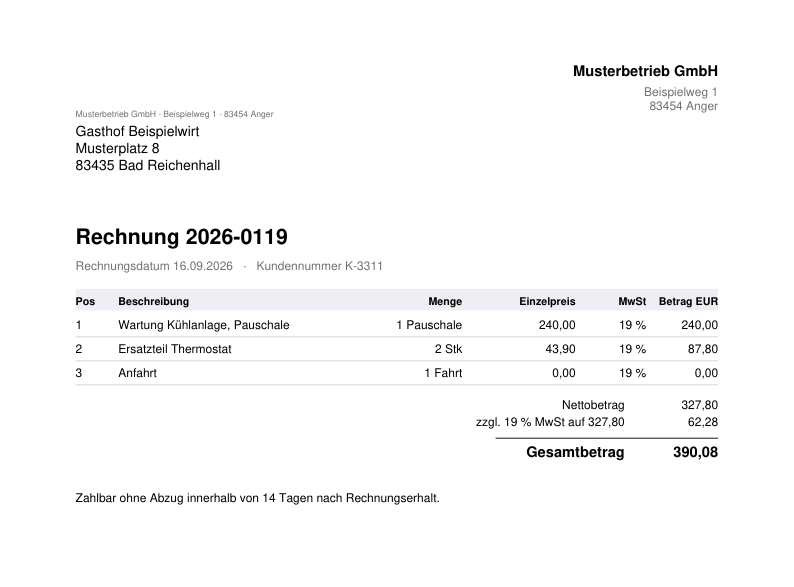

# pdf-invoice-extractor

Turns a folder of invoice PDFs into a structured Excel workbook — and refuses
to guess when a document is ambiguous.

The same problem is solved twice here: once as a Python package with a test
suite, and once as an [n8n workflow](n8n/). Both follow the same rules, which
is the point — the discipline is in the design, not in the tool. A second
workflow runs the other way, [from CSV rows to invoice PDFs](#the-other-direction-csv-rows-to-invoice-pdfs),
under the same rules.

```
$ python -m invoice_extractor examples/pdfs demo.xlsx
3 invoices, 8 line items -> demo.xlsx
total gross: 2,370.24
```

Two sheets come out: one row per invoice for accounting, one row per line item
for anyone who has to ask what was actually bought, joined by invoice number.

---

## The idea

Extracting invoices is easy to do badly. A parser that searches the page for
something total-shaped works on the twenty documents you tested it with and
returns a wrong number on the twenty-first. Nobody notices, because a wrong
total looks exactly like a right one.

So this package never guesses. Three rules:

**One adapter per layout.** No generic "find the total" fallback. Each supplier
format gets a class that knows where its fields are. An unrecognised document
raises `UnknownLayoutError` instead of being approximated.

**Amounts are parsed against a stated convention.** `1.234` is 1234 in German
and 1.234 in English — a factor of a thousand apart, and both look perfectly
normal in a spreadsheet. With `locale="auto"`, that string raises
`AmbiguousAmountError` rather than picking one.

**Dates are parsed against an explicit format list, day-first only.**
`03/08/2026` is the 3rd of August under every default format. A month-first
source is supported, but you have to say so — the choice stays visible in the
code instead of hiding in a heuristic.

Everything that cannot be read stops the run. A failed import is cheap; a
wrong number that reaches a booking system is not.

---

## Tests

`pytest` — 62 tests, no PDF files, under a tenth of a second.

That last part is deliberate. The adapters work on a `PdfContent` object
(text plus tables), so a test builds a page by hand. Simulating a supplier who
moved a field is three lines, and the suite runs on a machine with no sample
documents.

The tests worth reading are the ones about things going wrong:

| File | What it pins down |
|---|---|
| `tests/test_dates.py` | A real defect: a permissive parser read `03/08/2026` as the 8th of March instead of the 3rd of August and moved five months of invoices into the wrong quarter. Nothing crashed. The tests here make that reading impossible to reintroduce. |
| `tests/test_amounts.py` | The thousands-separator ambiguity, non-breaking spaces from PDF extraction, and a set of malformed inputs that must raise rather than come back as `0.0`. |
| `tests/test_adapters.py` | Unknown layouts, and — more important — layouts that still *match* but lost a field, which is how a supplier's template change turns into a hole in the data. |

The amount shape check exists because of one of these tests: `1.2.3` was
happily read as `123` once the separators were stripped, and the test caught it
before the code was ever used on anything.

---

## Adding a supplier

Write a class with `matches` and `parse`, and append it to `ADAPTERS`:

```python
class AcmeAdapter(InvoiceAdapter):
    name = "acme"

    def matches(self, content: PdfContent) -> bool:
        return "ACME Corp" in content.text

    def parse(self, content: PdfContent) -> Invoice:
        ...
```

Adapters are tried in order and the first match wins, so the ordering is
explicit rather than emergent.

---

## Install and run

```bash
pip install -e ".[dev]"          # pdfplumber, openpyxl, pytest
pytest                           # run the suite

pip install fpdf2                # only needed for the sample generators
python examples/make_sample_invoices.py     # three well-formed invoices
python examples/make_problem_invoices.py    # one unknown supplier, one broken template
python -m invoice_extractor examples/pdfs demo.xlsx --keep-going
```

Python 3.9 or newer.

By default the extractor stops at the first document it cannot read. Pass
`--keep-going` when triaging an unfamiliar batch: every file is attempted and
the failures are reported together, which reads as a to-do list of adapters to
write.

---

## The same thing as an n8n workflow

[`n8n/pdf-invoices-to-excel.json`](n8n/pdf-invoices-to-excel.json) — import it
into any n8n instance via *Workflows → Import from File*. No credentials are
stored in the file.

```
Schedule (every 15 min) ┐
Manual trigger ─────────┴─ Read files from disk      /data/pdfs/*.pdf
                             ├─ (error output: no files) → stop quietly
                             └─ Extract from file     PDF → text
                                 └─ Code: parse       one invoice per item, or fail
                                     ├─ Code: header rows  → XLSX → invoices.xlsx
                                     │   └─ Code: file away → /data/_beiseite ──┐
                                     ├─ Code: flatten items → XLSX → line-items.xlsx
                                     └─ (error output)                          │
                                         └─ Code: collect → CSV → problems_<ts>.csv
                                             └─ Code: file away → /data/pruefen ─┤
                                                                                 │
                                        Merge ◄───────────────────────────────────┘
                                          └─ Code: one log line → append protokoll.txt
```

The interesting part is the third branch. The parse node is set to
**Continue (using error output)**, so a document that cannot be read leaves
through a second output instead of killing the run. Good invoices still reach
the workbook while the broken ones are written to a dated problem report, named
per document. That is the same contract as `--keep-going` on the Python side,
and both were fixed to behave that way after the n8n build exposed that the
Python one was throwing the good invoices away with the bad.

Files are only moved out of the inbox **after both workbooks are written**. If
anything fails earlier, the PDFs stay where they are and the next run picks them
up again. Each run appends one line to `protokoll.txt`:

```
2026-09-11 11:51:23 | 2 gelesen | 1 fehlerhaft | brutto 1173.10
    ! kaputt_ohne_nummer.pdf: Rechnungsnummer nicht gefunden - Layout hat sich vermutlich geaendert
```

### Five things this cost an evening to learn

None of them are in the documentation, and the first three only surface on
n8n 2.x.

**The Code node has two modes and they are not interchangeable.** In *Run Once
for All Items* the code runs once for the whole batch and `$json` is the
**first** item — a parse loop written that way silently processes one document
and ignores the rest. *Run Once for Each Item* is what per-document work needs.
The flattening step, which turns 3 invoices into 8 line-item rows, needs the
opposite mode, because only there can a node return more items than it received.

**The error output rewrites your error message.** Messages thrown as
`"file.pdf: what went wrong"` arrive at the error branch as
`"what went wrong [line 8]"` — the prefix is dropped and an internal line
number is appended. Reading the file name back out of the message therefore
fails. The workflow fetches it from the reading node instead, via
`$('Read/Write Files from Disk').item.binary.data.fileName`, which only
resolves in *Each Item* mode.

**There is no Execute Command node any more.** It is gone from the official
Docker image, so `mv` is not an option for filing processed documents away. The
workflow uses `fs.renameSync` inside a Code node instead, which requires the
container to run with `NODE_FUNCTION_ALLOW_BUILTIN=fs`.

**`$now` is not a Luxon object inside the Code node.** Code runs in a separate
task runner process, where `$now.format()` throws `is not a function`. Worse,
that process ignores the container's `TZ`, so a hand-rolled `new Date()` stamp
comes out two hours off in summer. Both are solved by asking for the zone
explicitly:

```js
new Date().toLocaleString('sv-SE', { timeZone: 'Europe/Berlin' })
// → "2026-09-11 11:51:23", already almost ISO
```

Expressions in ordinary node fields are unaffected — they run in the main
process and still honour `GENERIC_TIMEZONE`. Which is exactly how a run can end
up writing `probleme_11-49.csv` next to a PDF stamped `09-49`.

**An empty inbox is an error, not a no-op.** The read node throws
`No file(s) found` when the glob matches nothing. Run by hand that is merely
odd; on a 15-minute schedule it means a red execution four times an hour. The
read node therefore has its own error output, leading to a No-Op node that ends
the run quietly.

The node names and code comments are German, the language it was built in.

---

## The other direction: CSV rows to invoice PDFs

[`n8n/csv-to-invoice-pdf.json`](n8n/csv-to-invoice-pdf.json) takes line-item
exports — the kind an ERP, a shop system or a spreadsheet produces — and writes
one finished invoice PDF per invoice number. Same inbox pattern, same rules:
nothing is guessed, and a document that would be incomplete is not written.



```
Schedule (every 15 min) ┐
Manual trigger ─────────┴─ Read files from disk      /data/csv/*.csv
                             ├─ (error output: no files) → stop quietly
                             └─ Code: read CSV        delimiter detected, RFC 4180 quoting
                                 └─ Code: validate    one item per invoice, or a problem
                                     └─ IF complete?
                                         ├─ Code: build PDF → /data/ausgabe/rechnungen/ ─┐
                                         └─ Code: problem report → problemfaelle_<ts>.csv ┤
                                                                                          │
                                       Merge ◄────────────────────────────────────────────┘
                                         └─ Code: file away   clean → _beiseite, flagged → pruefen
                                             └─ Code: one log line → append protokoll.txt
```

**The PDF is written by hand, in under 400 lines of plain JavaScript.** The
official n8n image has no PDF library and no way to install one, and the usual
answer — send the data to an HTML-to-PDF web service — means invoice data
leaving the building and an API key in the workflow. A PDF built from the
fourteen standard fonts is a manageable format, though: a handful of objects, a
cross-reference table of byte offsets, a trailer. The node carries the Helvetica
glyph widths so amounts can be right-aligned, breaks long invoices across pages
with a repeated table header, and numbers the pages. The text stays real text:
the PDF is searchable and copy-paste gives back the umlauts.

The rules, and the test file that exercises each one
([`n8n/examples/`](n8n/examples/)):

| Situation | What happens |
|---|---|
| `1.234` in a price column | Rejected as ambiguous — 1234 in German, 1.234 in English. Same rule as the Python side. |
| `1.2.00` | Rejected as a malformed thousands grouping instead of silently becoming 1200. |
| `31.02.2026` | Rejected: the format is right, the day does not exist. |
| A VAT rate of 5 % | Rejected: only the configured rates (0, 7, 19) are accepted. |
| Two rows of one invoice name different customers | The invoice is withheld; "first row wins" is exactly the kind of guess this avoids. |
| Position 1 appears twice | The invoice is withheld. |
| **One bad row in an otherwise good invoice** | **The whole invoice is withheld.** A PDF built from the remaining rows would be a plausible-looking invoice with a line missing. |
| A character outside the font's range (`✓`) | Replaced with `?`, and the replacement is named in the run log so nobody sends a mangled PDF unaware. |
| Semicolons and quotes inside quoted fields, a BOM from Excel, blank lines | Read correctly. |

The delimiter is detected from the header row rather than configured, and a tie
between two candidates is an error. `Extract from File` was the obvious choice
and was dropped for this reason: it picks a delimiter itself, and a German
semicolon file read as comma-separated arrives as a single column, three nodes
before anything complains.

That one-bad-row case was not in the first version. It came out of the test
bench, which runs the Code nodes outside n8n against the sample files — the
invoice with two rows, one of them broken, produced a tidy one-line PDF. The
workflow now counts rows per invoice number and refuses to build any invoice
with a rejected row.

Processed files are sorted by outcome: a file where everything went through
goes to `_beiseite`, a file with at least one problem goes to `pruefen`, so the
folder itself says where someone needs to look. Good invoices from a flagged
file are still produced; putting the corrected file back regenerates them under
the same file name, so they are overwritten rather than duplicated.

```
2026-09-18 15:19:03 | 3 Datei(en) | 51 Zeilen | 5 PDF | 10 beanstandet | brutto 1659.23
    ~ Zeichen ersetzt: ✓
    ! stoerfaelle.csv Zeile 2: "1.234" ist zweideutig - bitte den Dezimaltrenner "," benutzen
    ! sonderfaelle.csv 2026-0303: Keine Rechnung erstellt: 1 von 2 Zeilen fehlerhaft, das PDF waere unvollstaendig
```

The sender block, payment terms and allowed VAT rates are constants at the top
of their Code nodes — the only places a new user needs to edit.

**One more thing n8n does not tell you:** the Code node has a single output. A
validation step that wants to send good and bad items different ways cannot do
it by returning two lists; it marks each item and an IF node splits them.

## About this repository

A work sample by [Maik Wimmer](https://www.linkedin.com/in/maik-wimmer-166b2039a/),
who builds data extraction and reporting automation — Python, Power Automate,
Power BI, Excel.

The sample invoices are fictional. No client data appears anywhere in this
repository.

No licence is granted: the code is published to be read, not reused.
